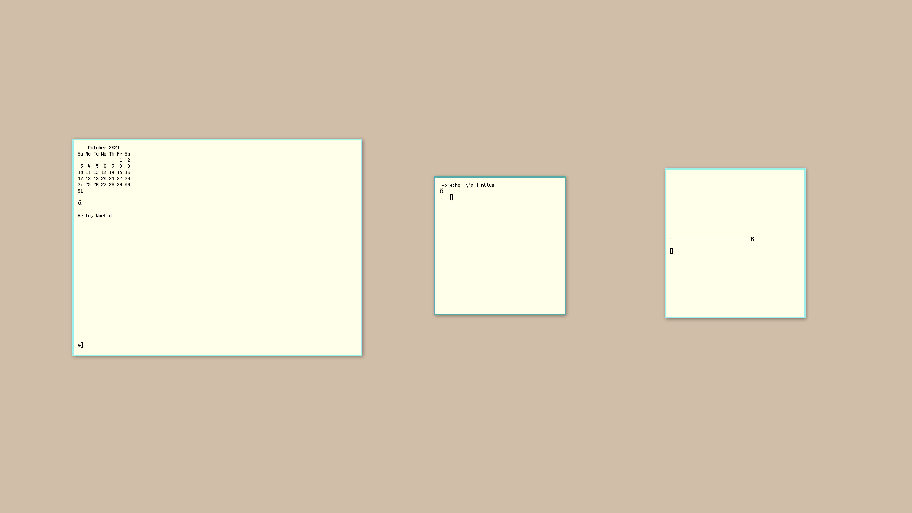

# 🌿 Ἑλλάς 🌿

wm: xmonad

editor: [merlin](https://merlinfo.github.io) + [aesop](https://github.com/merlinfo/aesop) / vim

shell: bash / dash

terminal: alacritty

browser: brave

calc: [basil](https://github.com/geremachek/basil) / [rose](https://github.com/geremachek/rose)

font: scientifica 
