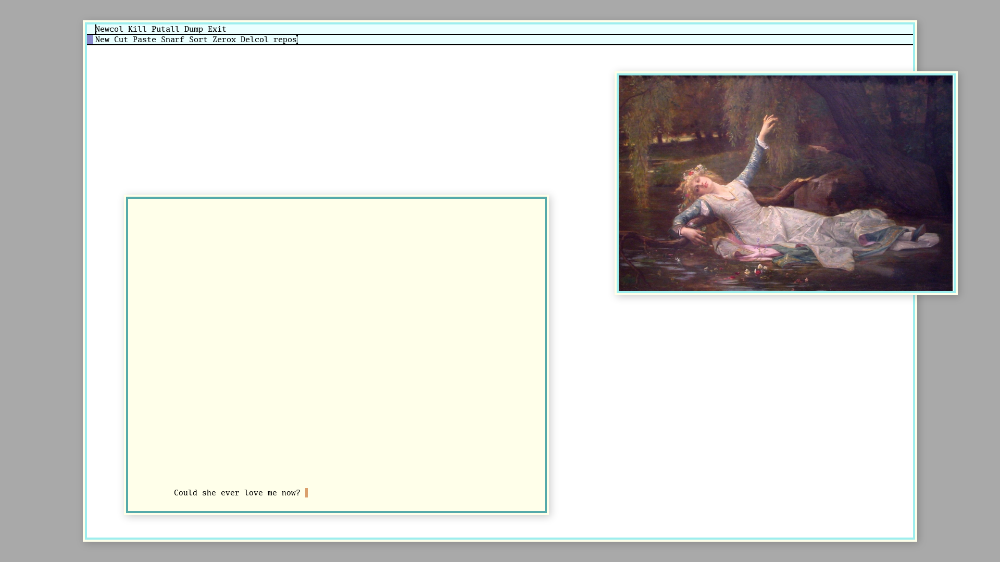

# { digital anthropology }

os: ubuntu

wm: 2bwm

editor: [merlin](https://merlinfo.github.io) + [ukko](https://github.com/merlinfo/ukko) / acme

shell: bash / dash

terminal: alacritty

browser: brave

font: Go Mono and Scientifica
