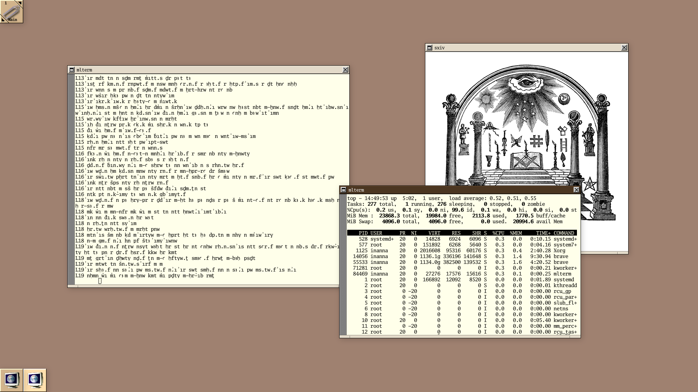

# { digital anthropology }

os: ubuntu

wm: windowmaker

editor: [merlin](https://merlinfo.github.io) + [ukko](https://github.com/merlinfo/ukko) / acme

shell: bash / dash

terminal: mlterm / alacritty

browser: brave

font: Go Mono and Scientifica

## What's included here?

Everything. As long as it doesn't conflict with my current set up, I'll keep the configuration files for anything I've ever used, so far that includes XMonad, 2bwm, and now Window Maker. All old versions of scripts, configs and anything that I've felt like I no longer need can be viewed through git history. Enjoy!
